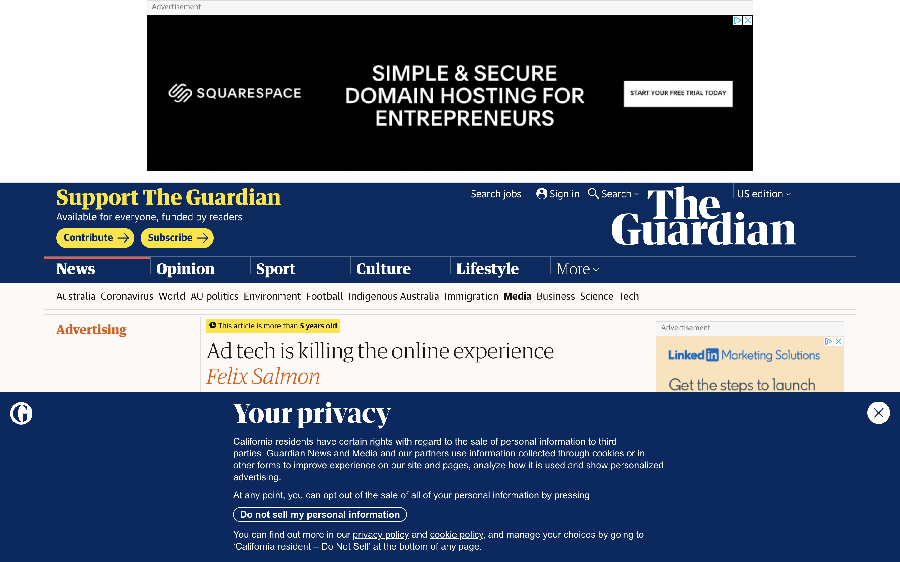

When the staff of [The Outline](https://theoutline.com/) was laid off and the site was shut down [last April](https://www.cjr.org/the_profile/the-outline-its-for-you.php), it was a loss for a cleaner, less aggressively monetized Internet. Their site featured a better reading experience than those on sites suffocated with ads and affiliate links. Instead of selling every possible pixel, The Outline's team created bespoke, individually designed ads designed to compliment the reading experience – not wreck it. So when the site was sold to Bryan Goldberg, a [human gargoyle](https://jezebel.com/hey-remember-how-much-bustle-founder-bryan-goldberg-su-1827548653) and a bad boss in an industry rife with bad bosses, those of us who anticipated the worst were eventually proved right. He chose to invest elsewhere and once again, we were stuck reading websites designed like tabloids.

Fast forward five very, very long months. If you spend time on the same corner of the Internet I do (the corner with good blogs), you've been anticipating the launch of [Defector](https://defector.com/) – a worker-run media company owned by the former staff of Deadspin following their walkout in protest of Barry Petchevsky's [firing](https://twitter.com/gmgunion/status/1189232634880286721) last October.

Tom Ley summarized the incident in Defector's inaugural post, which you can read [here](https://defector.com/how-we-got-here/). Really, go read it. I'll wait. And support independent media by tossing them $99 while you're there.

To summarize his summary, Tom writes that the Defector team wants to “create a website that you will actually *want* to read.” The goal is in response to their boss's meddling in their writing – a demand that they stick to sports despite Deadspin's undeniable traffic driven by politics, bears, recipes, and goofball humor.

That bad boss (I said we were rife with them) was [Jim Spanfeller](https://deadspin.com/this-is-how-things-work-now-at-g-o-media-1836908201), who looks like a decades-old file photo of someone in prison for mutual fund fraud. I mean, look at [this guy](https://nypost.com/2019/11/08/head-of-the-onion-deadspin-sued-for-sex-discrimination/). Despite owning a brain wrecked with dull ideas and venture capital, Spanfeller may have inadvertently uncovered a better path forward for an industry wrecked by dull ideas and venture capital. [Discourse Blog](https://discourseblog.substack.com/), another worker-owned venture founded by writers of fellow Spanfeller casualty Splinter, launched in July. [Brick House Collective](https://www.kickstarter.com/projects/1478924964/the-brick-house-cooperative), a “journalist-owned, wolf-proof home for independent media” made up of journalists with Deadspin and Splinter roots, is currently being crowdfunded.

Defector launched with their own website built by digital design agency Alley Interactive. Discourse Blog is built on Substack – the subscription-based newsletter service your friends have all started using this year. While Defector and Discourse Blog launched differently, they're both writer-owned companies pursuing sustainability over profitability with an honest subscription model. Like The Outline before them, I can comfortably turn my ad blocker off without risking damage to my flammable body, my flammable computer, or my flammable neighbors residing in a flammable building. Maybe there's a place for good blogs after all.

<ArticleMedia hasShadow caption="Defector's homepage">

</ArticleMedia>

## So what's nice about Defector's site?

Pages load fast and *feel* right. There's very little “cumalative layout shift” – the term for page jumpiness as images and ad scripts load. A huge part of my time designing at [VICE](http://aaron.mn/vice) was spent fighting layout shifts. Most of them were caused by crappy, third-party ads delivered in unanticipated sizes. This has become such a problem that [Google announced](https://www.theverge.com/2020/5/28/21272543/google-search-results-page-experience-load-time-contentfu-paint-layout-shift-top-stories-amp) they'll be taking cumalative layout shift into consideration with page ranking in 2021.

Along with performance, Defector's site places emphasis on… reading. When there are calls to buy a subscription or sign up for a newsletter, it's stated honestly. No mystery links masquerading as articles leading to dead end pages. Their UX copy also isn't written like a subway ad obfuscated with unnecessary wordplay or “democracy dies in darkness” style platitudes. They're asking you to download a podcast – not save the planet.

Like with The Outline, there are sponsors. Those sponsors are clearly labeled and presented in a way that doesn't detract from the page around it. Defector isn't trying to trick you into clicking on a sponsored Warby Parker article by [disguising it](https://www.tiktok.com/@betch/video/6848574969467768069) in a grid of non-sponsored writing. It's presented so plainly that despite being an ad, I don't resent the sponsor for getting in the way from those sweet, sweet blogs.

The site's not perfect. Defector uses the frustratingly common pattern of detecting “exit intent” by revealing a last-ditch popup when mousing out of the browser window – one of the more irritating trends to emerge over the last few years. But the site is still an improvement over the fully ad-supported nightmares I've become accustomed to navigating. And with the site launching less than a year after the aforementioned Deadspin walkout, hiccups can be expected.

## Here's the product part.

The cheeky “a website you will actually want to read” mission reflects something I struggled with during my time working in media. If you're a member of a product team at at a typical media company focused on profitability, you'll be asked to make your website, apps, and social media presence worse for your readers. You won't be given the opportunity to experiment and fail like The Outline did. You'll design incomprehensible features defined by sales terms, plaster intrusive ads on your most trafficked pages, and integrate slow, third-party ad products hawking celebrity gossip and diet fads. You're a user experience designer tasked with designing an unusable experience for your users, riddled with dark patterns meant to maximize ad impressions and viewability.

<ArticleMedia hasShadow caption="lol.">

</ArticleMedia>

It's easy to get discouraged in an environment like this. But if the Spanfeller casualties could leave and give us something better, why can't you?

There's no shortage of writing on media's transformation over the last decade. We've pivoted to video, catered to Facebook's algorithm, and a/b tested our headlines to the point of illegibility. Local newspapers are replacing local reporting with aggregated AP stories. Staff reporting is being wiped out in favor of crowdsourced posts that cost a fraction to publish. “Media is hard,” I've tweeted, following one of the rounds of layoffs that have all melded together. While journalists are eating the brunt of shit from their companies' failures, we can't forget about the product teams working on behalf of their company's lazy brained bosses, executing lazy ideas lazily.

<Tweet tweetLink="https://twitter.com/aaronshapiro/status/1304122073850224642" align="center" />

Rethinking how we monetize a struggling industry is harder than slapping another paid rectangle on a page, even with diminishing returns on each lower-brow ad product. When the options are months of risky design iteration or accepting an up-front offer from a loan shark like Outbrain or Taboola, the profitability vultures in charge will usually pursue the latter.

Can larger, ad-supported newsrooms succeed with a model like Defector's or Discourse Blog's? Paywalls aren't new. I'd been working on introducing accounts to VICE for years with expectations that they'd eventually be monetized. But there's something refreshingly DIY about Defector's approach. They don't treat their readers like a commodity. They speak to their readers like people – people who can make informed, honest choices with money that's increasingly harder to come by in the hell world we're occupying.

<Tweet tweetLink="https://twitter.com/drewmagary/status/1297938396162265089" align="center"  />

In the wake of The Outline's demoralizing closure, worker-owned companies like Defector and Discourse Blog are giving us relief from bosses who care more about profitability than writing. But because our lives are lived online, those writers and editors need product teams to show the same courage they did. It won't be easy. You'll make less money with less certainty. But you'll help build a better, more readable Internet that doesn't make you want to saw your entire head off.

The staff of Deadspin walked out in response to Petchevsky's firing, but Petchevsky was fired for protesting bad ideas from bad bosses. If you're a designer, engineer, or on a product team, you're fielding similarly bad ideas. How are you pushing back?

## “But Aaron, I'm a lowly cog.

Sure, okay. Here's what you can do.

We're talking about websites, so you probably have access to tools like Google Analytics. See how far people are scrolling. Try to deduce when and why people leave your site. When VICE introduced new ad products between articles in infinitely scrolling pages, for example, people stopped scrolling to second or third articles. Use numbers to make it indisputable that gunking up your site will make people leave. And if you don't know how to use your site's analytics tools, befriend your coworkers who do. They're probably nice.

It's not 2014. User research isn't a new practice anymore – especially to people who claim to understand product. Talk to real, human people about websites they like and dislike. Collect quotes about how obtrusive ads are annoying and make those people less likely to return to your site. Put those quotes in a slide deck so your boss can understand them.

If you're a designer, design options. Like, a lot of options. It'll improve your work. But more importantly, your boss will be more inclined to change their mind when they see their bad idea brought to life – especially if that bad idea is presented next to a better one.

Remember there's a reason dozens of newsrooms have [unionized since 2017](https://www.axios.com/media-talent-strikes-back-union-writers-guild-hollywood-86b24f65-6d5f-4e1a-9f83-cc09a405d28d.html). Talk to other workers in your company about what isn't working. Follow groups like the [Tech Workers Coalition](https://twitter.com/techworkersco), Coworker.org, and Collective Action in Tech. Read tech labor reporting from people like my former colleague [Lauren Kaori Gurley](https://twitter.com/LaurenkGurley). Even if you don't fully organize your workplace, remember that collective action is more powerful than individual action – especially when you're pushing back on your bosses' *really* [bad ideas](https://www.theverge.com/2019/10/9/20906213/github-ice-microsoft-software-email-contract-immigration-nonprofit-donation).

Or you, like the Defector and Discourse Blog teams, could leave and do something better.