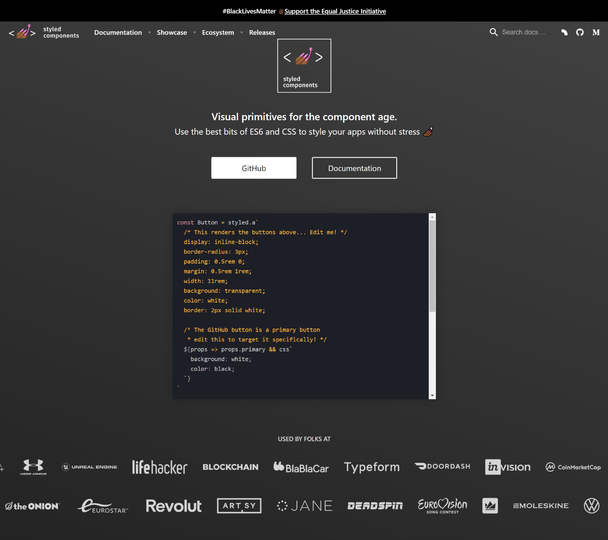
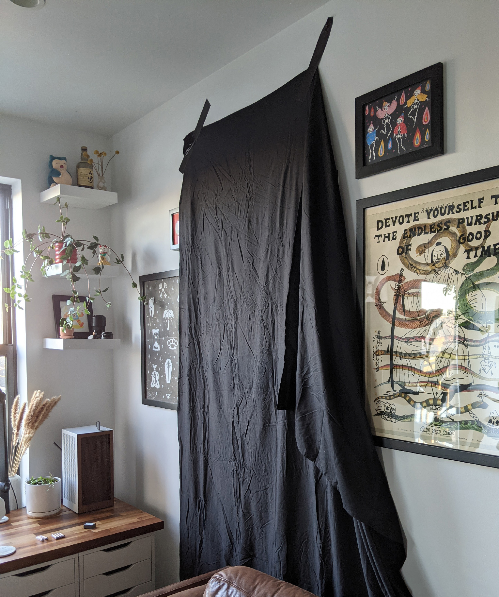

I'm a product designer – whatever that means.

With a profession as vaguely defined as ours, people are identified by their skillsets. Product designers are researchers, illustrators, architects, and animators. Some of us become managers or communicators. I grew up writing bad HTML in the Geocities era and while I eventually studied graphic design, my goal was to be a website _builder_. Technical proficiency has always been important to me. My work is informed by how it's built as much as what it provides to its audience.

Our skills aren't permanent. Technology moves fast. Research methods change. Styles evolve. Languages and frameworks emerge. I spent four years at VICE doing what the team needed me to do – designing mockups, advocating for our product throughout the company, and eventually managing our team. Code was best left to the engineers because I was more efficient elsewhere. While I never stopped identifying as “technical,” I got rusty. So when I left VICE in September, it was time to relearn to code.

## Building on Gatsby

My previous site was built with [Middleman](https://middlemanapp.com/) – a Ruby-based static site generator (SSG) I learned in 2015. An SSG was perfect for a website updated as infrequently as mine. Page templates and data were split apart locally, but it compiled to simple HTML, CSS, and JavaScript. Because it was static, I hosted it subscription-free on Github pages.

But like I said, our industry moves fast. Middleman felt ancient compared to the tools I watched our engineers use at VICE. When I learned about [Gatsby](https://www.gatsbyjs.com/) – a more contemporary React-based SSG, I decided to give it a try.

<ArticleMedia hasShadow caption="Gatsby">


</ArticleMedia>

I never _really_ learned JavaScript. Libraries like jQuery simplified basic interactions while obfuscating what was actually happening in the browser. Relying on those libraries limited my work to what was available with plugins and Stack Overflow answers.

Gatsby similarly obfuscates routing, image handling, and creating pages. This is a huge benefit – I've come to learn those things can be tedious – but it’s important to learn rules before breaking them. As I was building the components that make up this site, I still didn’t understand foundational React concepts like [state](https://reactjs.org/docs/state-and-lifecycle.html). Pages were rendering and rerendering in unexpected ways. Tutorials were hard to follow because they assumed a level of knowledge I was lacking.

So I stepped back and started from the beginning. I studied [ES6](https://www.w3schools.com/react/react_es6.asp) to understand how to correctly write a loop or a function in React - even if classic JavaScript syntax still worked. I completed [Bob Ziroll's Scrimba course](https://scrimba.com/learn/learnreact/) and watched most of [freeCodeCamp's YouTube course](https://youtu.be/4UZrsTqkcW4) to fill gaps.

Shortcuts are great for implementing one-off interactions, but learning fundamentals eventually pays off.

## Unlearning old habits with Styled Components

After seeing our codebase bloat at Etsy, I developed techniques for structuring scalable CSS. We organized our code and files using agreed-upon rules. We wrote generic, highly specific classes that could be used across components. It was highly opinionated and we had to fight to ensure other contributors stuck to our guidelines. So when I saw [Gatsby recommended CSS-in-JS](https://www.gatsbyjs.com/docs/tutorial/part-two/), I scoffed. It seemed like an over engineered solution to a problem that could be solved with planning and restraint.

<ArticleMedia hasShadow caption="Styled Components">



</ArticleMedia>

I mean, look at that syntax! It's practically CSS. Why not just use CSS?

So I started by writing CSS like I've always done. I created a global stylesheet. When I designed new components, I adjusted old components to work with new styles. But like they usually do, components broke. Exceptions emerged. Scope leaked. I found myself spending as much time refactoring old CSS as much as I was writing new CSS.

Eventually I tried [Styled Components](https://styled-components.com/) and hey, it rocks. Scoping CSS to a single component is something I'd always manually solved through namespacing and restraint. With Styled Components, I'm able to use simple, semantic names without worrying about how they affect styles in other components.

My card component's styles look something like this, for example.

```
const Wrapper = styled.div`
    margin-bottom: 40px;
    &:last-child {
        margin-bottom: 0;
    }
`

const Title = styled.h3`
    margin-bottom: 8px;
`

const Description = styled.p`
    margin-bottom: 16px;
`
```

Those styles are then used to construct the component.

```
import React from "react"
import * as Styled from "./styled"
import Button from "../Button

export default (props) => {
    return (
        <Styled.Wrapper>
            <Title>{props.title}</Title>
            <Description>{props.description}</Description>
            <Button>{props.cta}</Button>
        </Styled.Wrapper>
    )
}
```

It's clean, too. Here’s how my styles are structured:

```
📦 src
  📂 components
    📂 Button
      📜 index.js
      📜 styled.js
    📂 Nav
      📜 index.js
      📜 styled.js
    📂 WorkCard
      📜 index.js
      📜 styled.js
  📂 styles
    📜 global.js
    📜 themes.js
```

Global styling for CSS variables and typography still exists. All other styles and animations are scoped to their respective components.

Coolest of all, it let me define `themes.js` – a file that stores light and dark theme values.

```
export const light = {
    background: "#FFFFFF",
    link: {
        normal: "#0000FF",
        hover: "#000000"
    },
    ...
}

export const dark ={
    background: "#171722",
    link: {
        normal: "#0085FF",
        hover: "#FFFFFF"
    },
    ...
}
```

Individual components can ingest those values, which makes trivial to [create a theme switcher](https://css-tricks.com/a-dark-mode-toggle-with-react-and-themeprovider/). Here's how it looks in my button component.

```
const Button = styled.Link`
    color: ${props => props.theme.link.normal };
    ...
}
```

Like with CSS preprocessors, it's easy to overengineer solutions to problems. Relying on Styled Components for theming and scoping without writing too much JavaScript alongside my CSS was a nice middle ground.

### Animating with Framer Motion

I’ve used [Framer](https://www.framer.com/) for design prototyping, but I wasn’t familiar with their [motion library](https://www.framer.com/motion/).

Like with Styled Components, it's easy to be skeptical. You can write animations in CSS. CSS animations are tedious to write though – especially if you want to tie them to JavaScript events or use complex easing.

Framer Motion uses a dead simple syntax. Revealing an element on page load is as simple as this.

```
const animation = {
    visible: { opacity: 1 },
    hidden: { opacity: 0 }
}

...

<motion.div
    initial="hidden"
    animate="visible"
    variants="animation"
/>
```

You can easily tie those animations to hover states, gestures, or other JavaScript events. But these are still things you can technically accomplish with CSS. What convinced me to use Framer Motion was their [AnimatePresence](https://www.framer.com/api/motion/animate-presence/) feature.

Animating components _in_ is easy. CSS animations automatically trigger on newly mounted components. But from what I could tell, there's not a simple, native way to animate components _out_. AnimatePresence gives your animations an <code>exit</code> prop. Your component is delayed from unmounting until after the prop's animation plays. In other words, the above animation look like this:

```
const animation = {
    visible: { opacity: 1 },
    hidden: { opacity: 0 }
}

...

<motion.div
    initial="hidden"
    animate="visible"
    exit="hidden"
    variants="animation"
/>
```

By giving each of my animated components an <code>initial</code>, <code>animate</code>, and <code>exit</code> prop, pages transition in and out seamlessly. Seriously, it's that simple.

<ArticleMedia hasShadow caption="In case you missed them">

<video autoPlay muted loop>

<source src="/writing/on_relearning_to_code/site_animations.mp4" type="video/mp4" />

</video>

</ArticleMedia>

## Not all problems have technical solutions

I wrote, rewrote, and refactored a lot of code over the last month. Learning new things is hard. Sometimes when your brain is in a fog you have to log off, tape a bedsheet to your wall, and turn your Covid-era apartment into a bootleg photo studio.

<ArticleMedia caption="Ingenuity">



</ArticleMedia>

Despite how low-rent this looks, you too can have a <Link to="/info">dramatic headshot</Link> for the price of one bedsheet.

## It's a start.

I had a lot of fun going overboard for the sake of learning something new. Night mode was unnecessary. Recomposing my case studies in Markdown and serving them with GraphQL was unnecessary. Adding one line of jiggly text to my bio was _definitely_ unnecessary, but it made me laugh. More features should be prioritized by whether they make someone laugh.

Thanks for reading. To the engineers who caught me using a wrong word or two, please be nice to me. I'm fragile.