<ArticleMedia caption="">

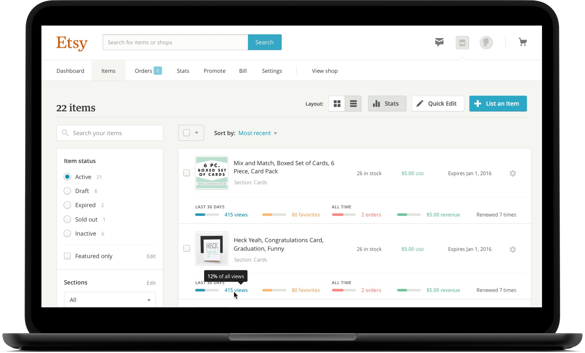

</ArticleMedia>

Before joining Cover in 2015, I was a member of Etsy's product design team. It was a transformative time for the company as we assembled a new team of researchers and tripled the number of product designers. This led to more collaborative product development in contrast to the loose, engineering-first process that preceeded my time there.

While my role as Staff Product Designer meant I spent time mentoring younger designers and helping intiate some of these changes, I also led design on several projects.

## Seller Onboarding

Etsy's tools for its sellers were powerful, but getting started was complicated. Forms and customization options were presented with little explanation. The process was also nonlinear, so it was unclear where to start. We simplified onboarding by reducing the number of steps and offering contextual suggestions when appropriate.

<ArticleMedia hasShadow caption="Entering billing information during seller onboarding">

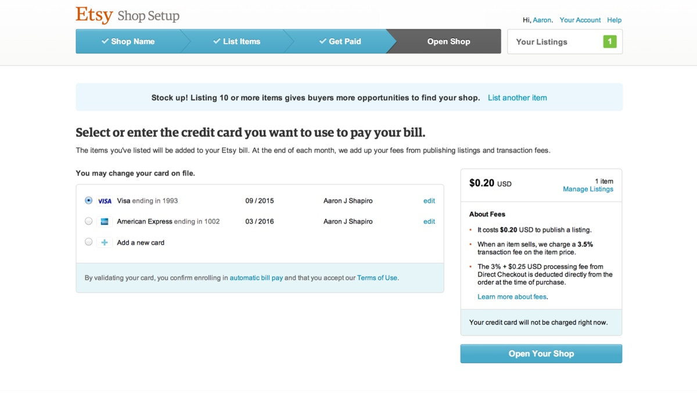

</ArticleMedia>

## Product announcements

Sellers are understandably sensitive about how their listings appear across Etsy's different platforms. After launching a year-long redesign of the listing page on Etsy.com, we were sure to carefully communicate what had changed. Alongside blog and forums posts, we designed a page that visualized what was new.

<ArticleMedia hasShadow caption="Introducing Etsy's new listing page">

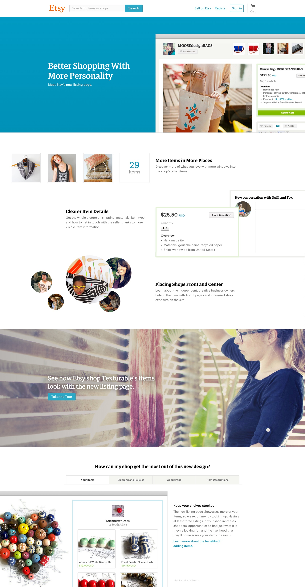

</ArticleMedia>

## Introducing manufacturing

For most of its history, Etsy strictly limited its marketplace to handmade items. Over time though, its most successful sellers found themselves hindered by that policy. To meet their shops' demand, many of these sellers were "graduating" from Etsy – being forced to leave for other platforms with looser guidelines on hiring employees.

We knew changing handmade policies would risk agitating the community, but these departures were becoming a problem. Our solution was an application process to ensure sellers were working with responsible manufacturing partners.

<ArticleMedia hasShadow caption="Screenshot of Etsy's manufacturing partner application form">

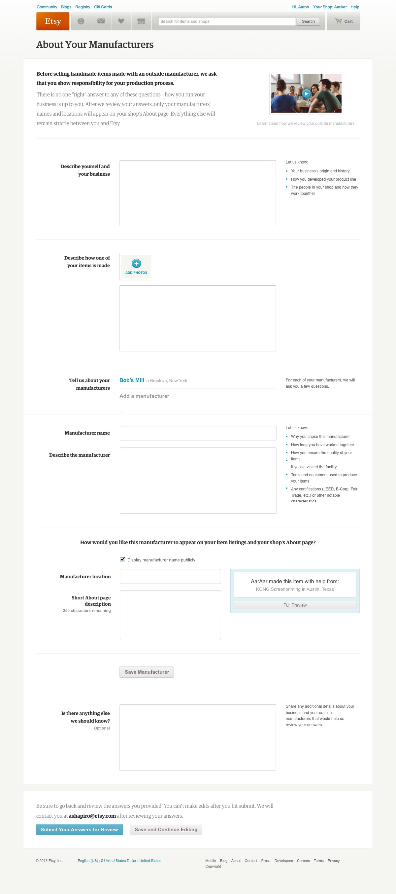

</ArticleMedia>

Along with Etsy's new policies, we answered questions during a streaming town hall session and created a page explaining the changes.

<ArticleMedia hasShadow caption="Introducing manufacturing guidelines">

</ArticleMedia>

## Better tools for sellers

I began my second year at Etsy by joining the Shop Management team – a group dedicated to improving tools for sellers. By visiting sellers' studios during the busy holiday season, we noted shortcomings in the product and the workarounds sellers developed to solve for them.

<ArticleMedia hasShadow caption="Helping ship orders at ElloThere's Brooklyn studio">

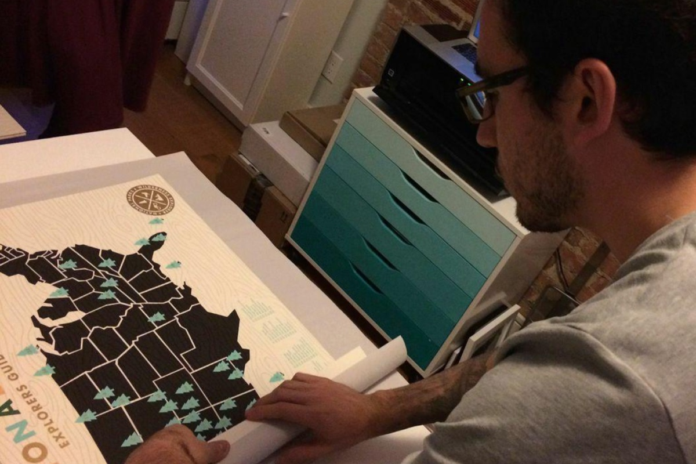

</ArticleMedia>

### Shipping profiles

The most painful problems revolved around accepting and fulfilling orders. Our first project was a simple tool for shipping profiles – a way to apply and edit your listings' shipping information in bulk.

<ArticleMedia hasShadow caption="Screenshot of shipping profiles in Etsy's old listings manager">

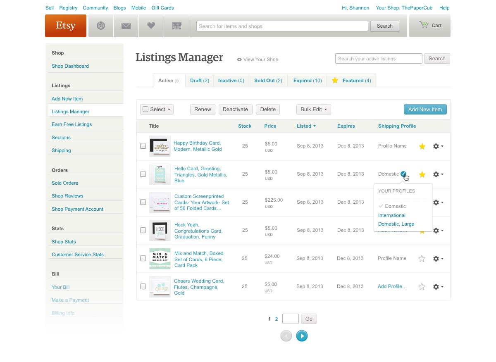

</ArticleMedia>

Sellers liked the new feature, but we uncovered a problem while discussing what to tackle next. Years of adding new tools rather than strengthening existing ones had led to a disjointed experience. Core workflows like organizing inventory, fulfilling orders, and communicating with buyers were spread across several pages. During some of our studio visits, sellers were even placing browser windows side-by-side to accomplish one task.

After lengthy conversations with other team leads, we decided to address the problem by dedicating the following year to redesigning the suite of seller tools. During those conversations, we defined three key goals:

### 1. Think of pages as workflows rather than features

After documenting each feature scattered across dozens of pages, we grouped them into core workflows – inventory management, order fulfillment, billing, promotion, statistics, and settings. Each workflow would be represented by a single page.

### 2. Design for every screen size

Etsy.com's base layout was a static 980 pixels wide, but we knew sellers were using large screens in their studios and their phones on the go. Since we would be redesigning the entire suite of tools at once, we were comfortable creating a responsive layout that would work everywhere.

### 3. Save sellers' time with faster tools

Similarly, the team's engineers saw the redesign as an opportunity to experiment with creating single page web application. This would speed up small changes like price and stock adjustments. If we were successful, we could then extend the framework elsewhere on Etsy.com.

### 4. Work in a closed prototype

Since this would be an uncharacteristically long project, we would invite 50 sellers to a closed prototype to give us continual feedback. This would grow to thousands as we neared launch later that year.

We began with a tool for managing listings, taking an approach that more closely resembled the grid layout of a seller's actual shop.

<ArticleMedia hasShadow caption="An early wireframe for the new listings manager">

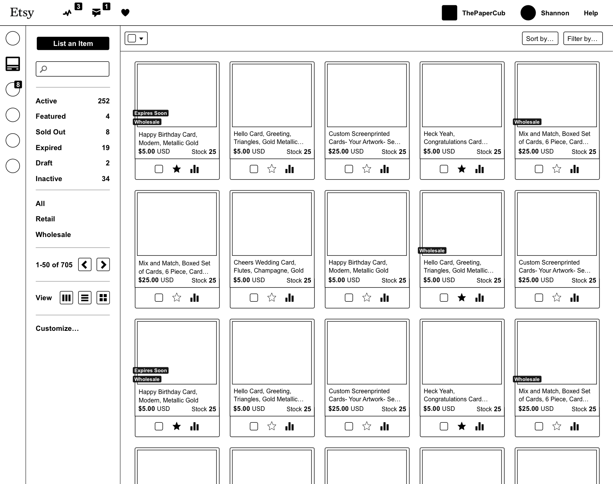

</ArticleMedia>

I always begin projects by quickly iterating with black and white wireframes. This let us share work in person and on Basecamp to generate new ideas and validate existing ones. We also shared work at this stage with sellers by creating functional prototypes connected to their real listings.

<ArticleMedia hasShadow caption="Editing listings in a panel rather than a separate page">

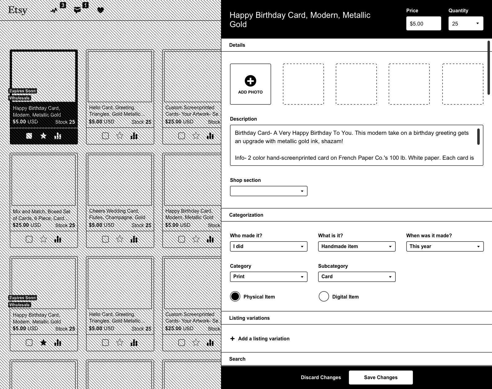

</ArticleMedia>

Prototypes helped us understand how sellers wanted to manage their listings. We removed a layout option, made the most common filters more prominent, and simplified navigation.

<ArticleMedia hasShadow caption="Making adjustments after transitioning from wireframes">

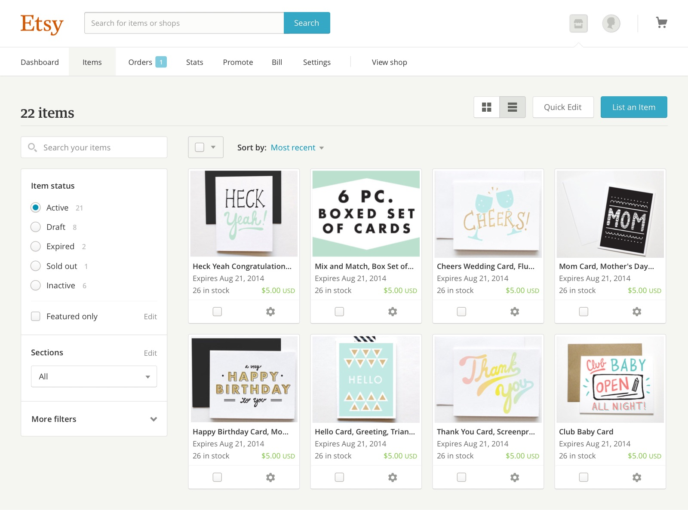

</ArticleMedia>

Over time, we integrated previously separate features like organizing inventory into sections. We also added new functionality like inline editing, listing analytics, and additional bulk editing tools.

<ArticleMedia hasShadow caption="Adding listing analytics to the listings manager's list view">

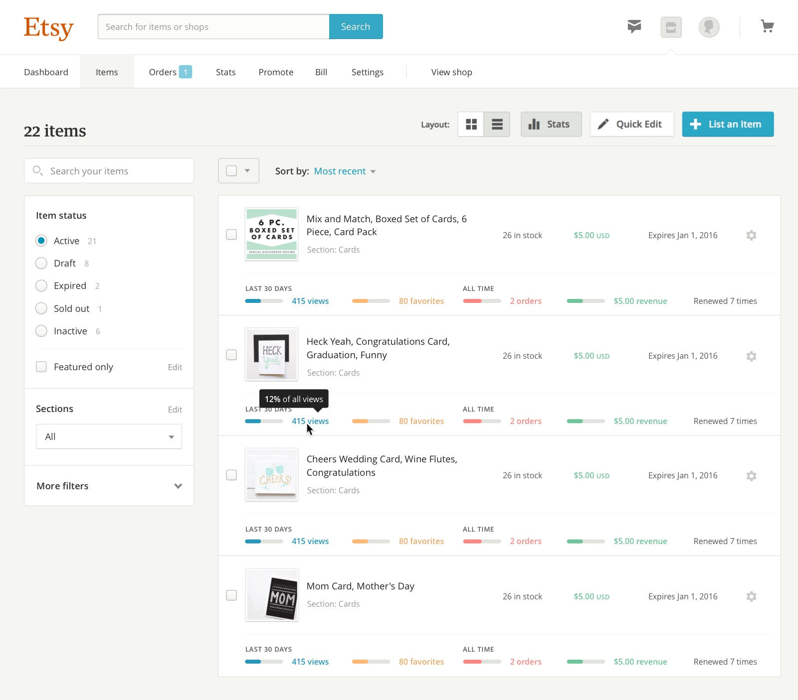

</ArticleMedia>

## A living style guide

While working on the redesign, I was joined by [Diana Mounter](http://twitter.com/broccolini), [Jessica Harllee](http://twitter.com/harllee), and [Dennis Kramer](http://twitter.com/dennispkramer). As I completed work on the listings manager, they began work on order fulfillment, creating a new item listing (which Jessica wrote about [here](http://jessicaharllee.com/work/etsy-listings-manager)), and shop statistics. With each of us working on separate parts of a cohesive suite, it became important to make styles flexible, reusable, and well documented.

Etsy's previous web-based style guide was incomplete and outdated. I had been maintaining a Sketch file with our components, but this was impossible to enforce when implementing work.

<ArticleMedia hasShadow caption="Etsy.com's components in Sketch">

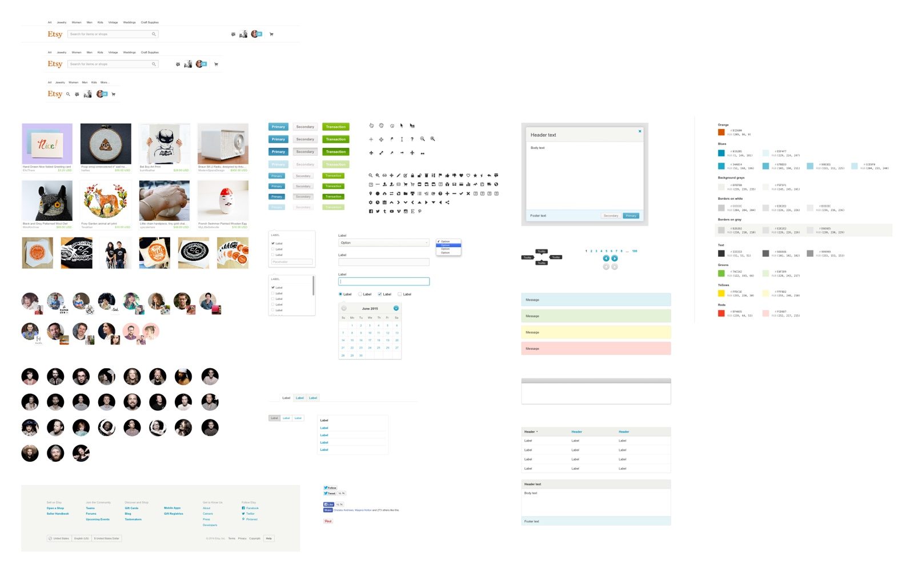

</ArticleMedia>

We solved this problem by creating a style guide using the framework we had built with the new listings manager. I began by thoroughly documenting each of our components. Diana, Jessica, and Dennis contributed by proposing a strict object-oriented CSS approach, creating lessons, and filling in missing components.

<ArticleMedia hasShadow caption="Grid system documentation in the new style guide">

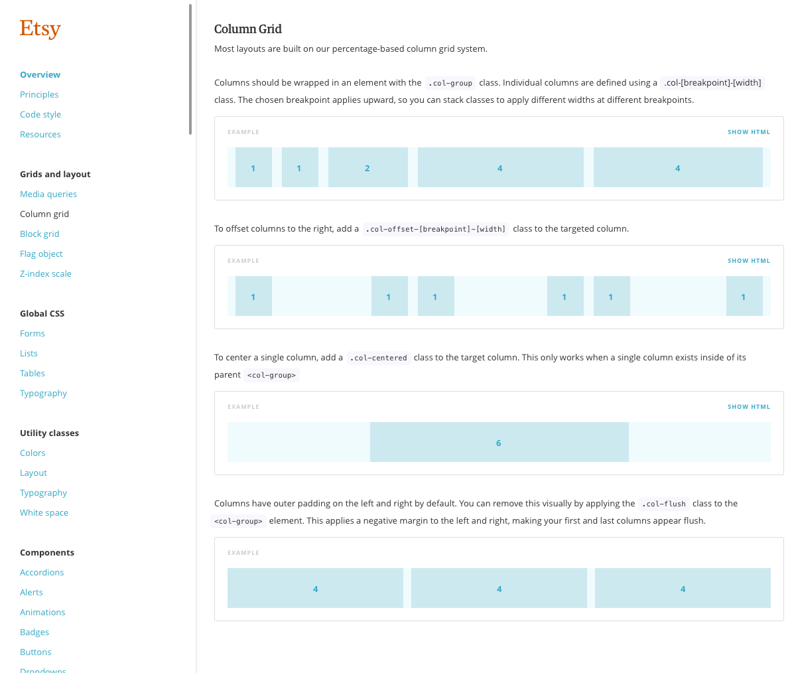

</ArticleMedia>

Our new styles were built with Sass, letting us quickly iterate with variables and stay organized with partials. I advocated for Sass's use throughout the company, eventually helping convert the Etsy's codebase to use it, and led a number of presentations on using it responsibly.

Because the style guide was made up of hundreds of component and utility classes, it helped us create new pages without writing a single line of CSS. This was especially useful for prototyping, and product designers elsewhere in the company began asking when they could use it.

Diana, Jessica, Dennis, and I led sessions on our philosophy on object-oriented CSS, collaboration through pull requests, and demonstrations. This put other product designers in a position to contribute, eventually making the style guide available throughout Etsy.com. To ensure consistency at this scale, I helped organize a style guide group that met regularly to discuss everything from our use of webfonts to how we could iterate on listing card treatments.

## Thanks

I grew more at Etsy than any other time in my career. From learning how to contribute to a large codebase to developing a philosophy on collaborative product development, I left as a more valuable team member.

It's impossible to mention everyone, but I'd like to thank [Cap Watkins](http://twitter.com/cap), [Russ Posluszny](http://twitter.com/russpos), [Nickey Skarstad](http://twitter.com/NickeySkarstad), [Kim Bost](http://twitter.com/kimbost), [Jason Huff](http://twitter.com/jsnhff), and [Randy Hunt](http://twitter.com/randyjhunt) along with the designers and engineers on the Shop Management team for helping make my two years at Etsy great.
