<ArticleMedia caption="">

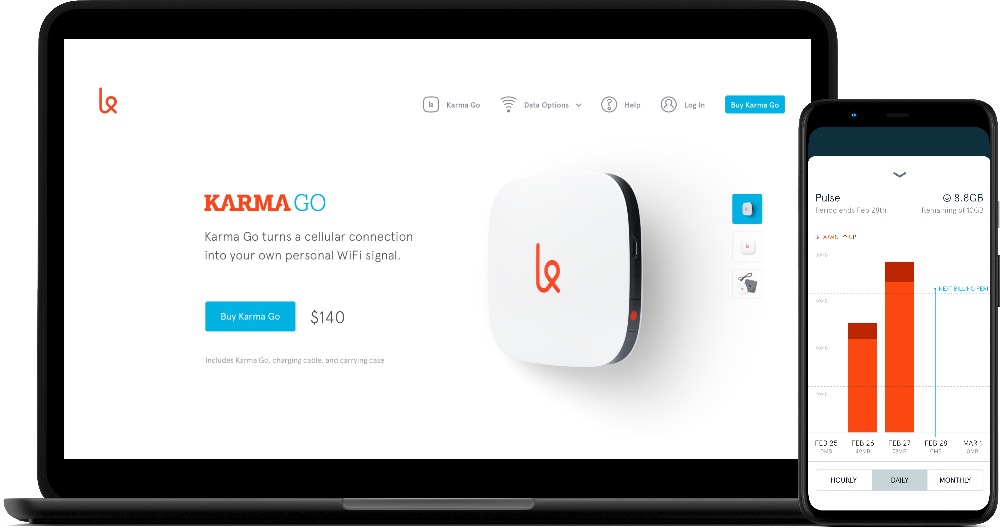

</ArticleMedia>

My first experience relying on a WiFi hotspot was during a trip to Tokyo in 2015. I'd previously relied on Verizon and AT&T's international travel plans, but they were prohibitively expensive, had uncomfortable data caps, and lived on confusing account pages. Renting an affordable LTE hotspot with unlimited data was liberating, letting me focus on my trip rather than rationing data and draining my phone's battery.

Our lagging cellular infrastructure means we're years away from having similar products stateside, but one company had been on my radar for taking a different approach than Verizon and AT&T. Karma had two easy-to-understand plans headlined by pay-as-you-go data that never expired. And fitting with companies like Nest, Casper, or Harry's who have elevated products that historically suffered from poor design, Karma's beautiful hotspot stood out.

In early 2016, I joined Karma as their second product designer with the goal of making Internet access affordable and accessible.

<ArticleMedia hasShadow caption="Karma Go">

</ArticleMedia>

## Goodbye, Neverstop

The day I arrived at Karma, we were in the process of discontinuing our monthly subscription service called Neverstop. Karma is a mobile virtual network operator (MVNO) – a type of data provider that doesn't own its network. Instead, we rely on data purchased wholesale from Sprint. We loved Neverstop's simplicity – $50 for contract-free, unlimited Internet access – but customers' unexpectedly heavy data usage outweighed what we could afford. The plan was unsustainable.

<ArticleMedia hasShadow caption="The Verge reporting on Neverstop's cancellation">

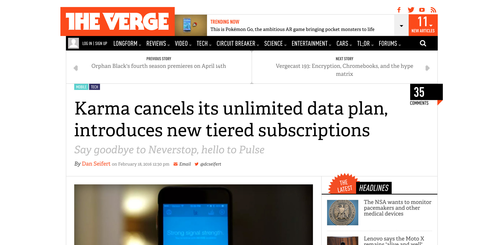

</ArticleMedia>

My job was to work on Neverstop's replacement – a capped, monthly subscription service we named Pulse. The new plan would be less appealing than Neverstop and we expected people to switch to our pay-as-you-go option, but we wanted to avoid disrupting service for our subscribers. Because we were losing money each day Neverstop remained online, it was important to work quickly.

Unlike Neverstop's one-price-fits-all model, Pulse would have three tiers with varying amounts of expiring, monthly data. This meant our native apps and website required more than replacing the name and pricing. We would need to update nearly the entirety of our native apps and website, including our storefronts, account pages, and usage screens.

<ArticleMedia hasShadow caption="Karma's updated store and switching Pulse tiers">

<Grid>

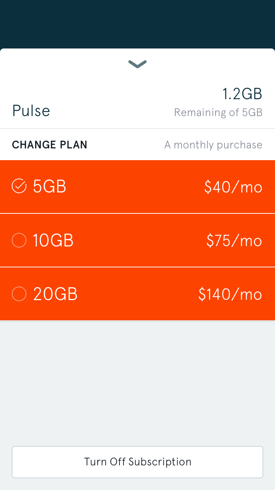

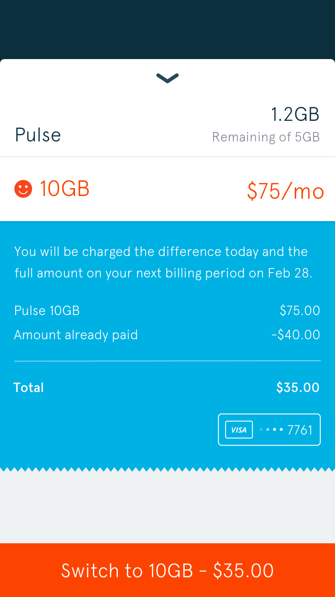

</Grid>

</ArticleMedia>

Since there were more options available, subscribers' account screens needed to be updated. We also needed to design states for subscribers running out of data, giving them options to purchase more to avoid being stuck offline.

<ArticleMedia hasShadow caption="Karma's updated billing screen and an example out-of-data state">

<Grid>

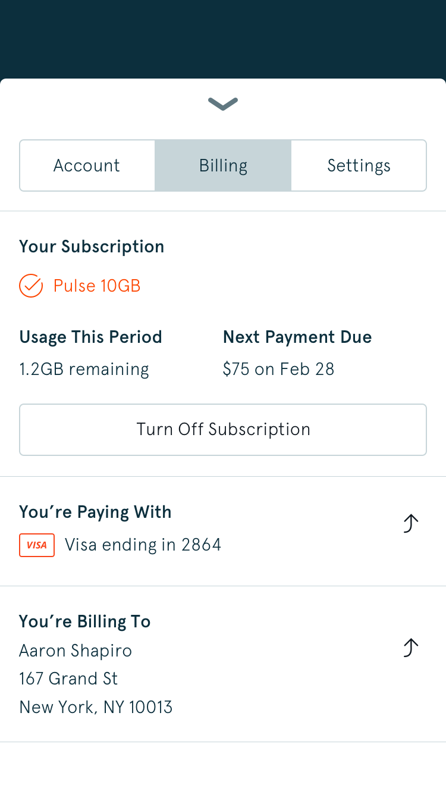

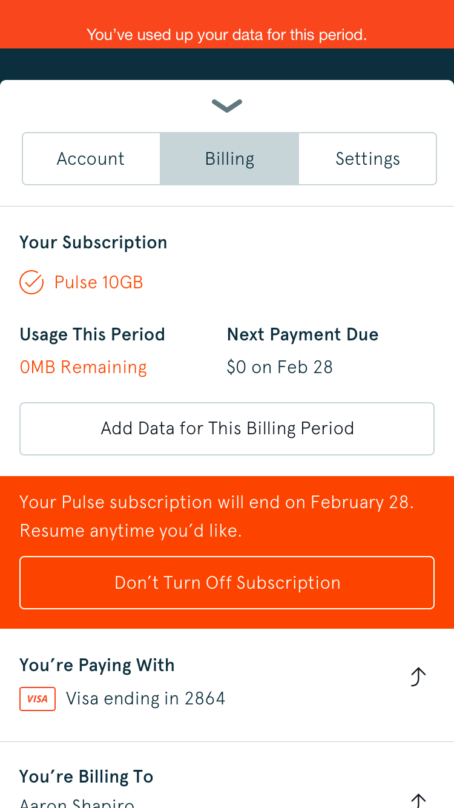

</Grid>

</ArticleMedia>

With new caps, we had to better communicate subscribers' remaining data for their billing period. Since this was more complex than the other screens, I began by wireframing as many rough ideas as possible – giving the team starting points to base discussion and decision making on.
 
<ArticleMedia hasShadow caption="Usage screen wireframes">

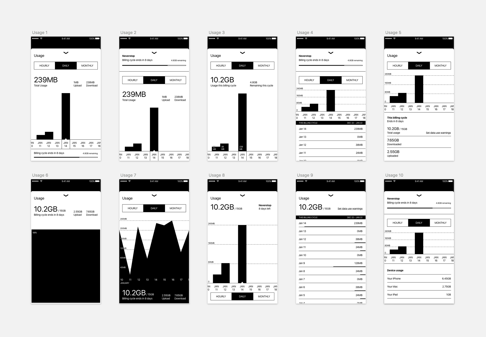

</ArticleMedia>

We decided on a direction that resembled the existing usage screen that now highlighted daily, monthly, and yearly usage alongside the subscriber's plan and its renewal date.

<ArticleMedia hasShadow caption="Karma's updated usage screen">

<Grid>

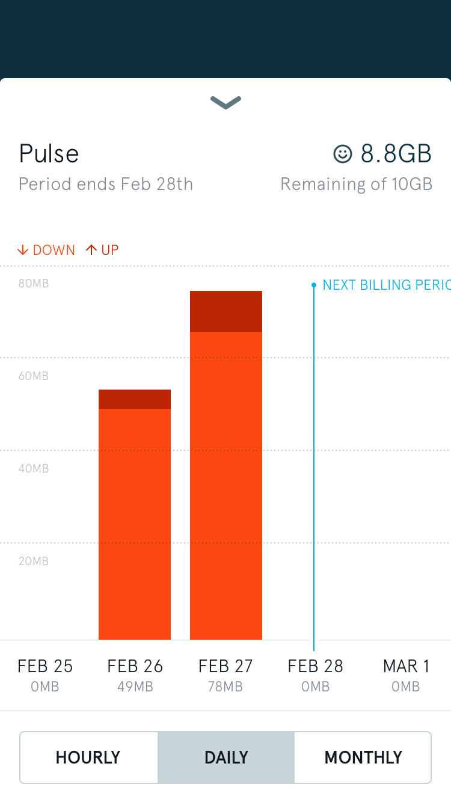

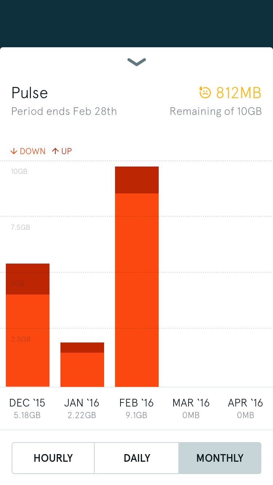

</Grid>

</ArticleMedia>

Since we were making adjustments throughout the app, <Link to="https://twitter.com/alandickinson">Alan</Link> and I took the opportunity to clean up design inconsistencies. <Link to="https://zeplin.io/">Zeplin</Link> became useful for sharing these changes with our engineers, giving them an easier way to calculate iOS and Android units on our new grid, reduce the number of type styles, and fix mislabeled colors.

<ArticleMedia hasShadow caption="App mockups organized in Zeplin">

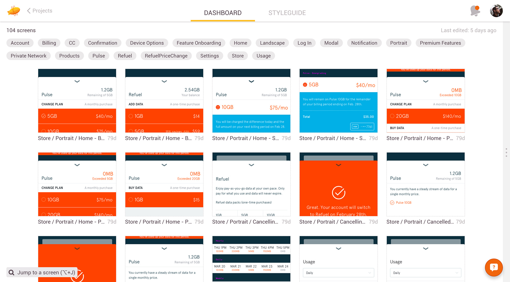

</ArticleMedia>

We tried to maintain feature parity between our apps and the web, so we designed a simplified web dashboard to more easily manage Pulse subscriptions. Our redesign consolidated the existing web dashboard from five pages to one, while still surfacing once-hidden usage details.

<ArticleMedia hasShadow caption="Signed in dashboard with expanded usage graphs">

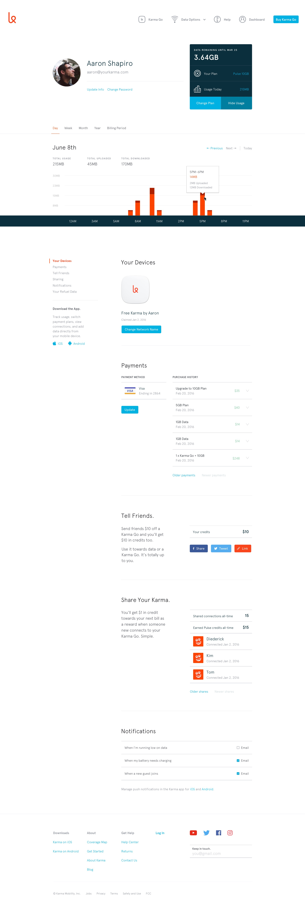

</ArticleMedia>

A gigabyte is abstract. For most subscribers who relied on Karma Go for email and web browsing, their experience wouldn't change. To talk about the new data caps in a way that was more understandable, we created a series of blog and social media posts explaining what really goes into a gigabyte.

<ArticleMedia hasShadow caption="Data usage animations">

<Grid>

</Grid>

<Grid>

</Grid>

</ArticleMedia>

## Revamping the website 

Even with the disappointment surrounding Neverstop, we were happy with Pulse's launch. But our worry-free, unlimited data plan that had differentiated us was now as worry-inducing as capped plans from AT&T, Verizon, and others. Our customer's excitement from Neverstop's launch in September had been replaced by frustration on social media, Karma Go returns and subscription cancellations.

We believed we still had a great product, so we chose to update our website to better emphasize it.

### Leading with sharing

Karma's differentiator is its sharing model. Because of its open SSID, anyone can connect to a Karma Go and get online with their own data. The owner is rewarded with free data of their own, making them feel good about getting others online in the process. Every day, we would receive emails from excited customers who had earned hundreds of megabytes by leaving their Karma Go on at airports or festivals.

<Tweet tweetLink="https://twitter.com/Werner/status/721821758773456896" align="center" />

Our homepage hadn't been updated in several months. Since its launch, Neverstop came and was replaced by Pulse – a different model than the strictly pay-as-you-go language we led with.

We needed to show our two data options alongside clearer shots of Karma Go and more visible app download links. Most visibly though, we also decided to dedicate space to feeling good by sharing.

<ArticleMedia hasShadow caption="Homepage wireframes">

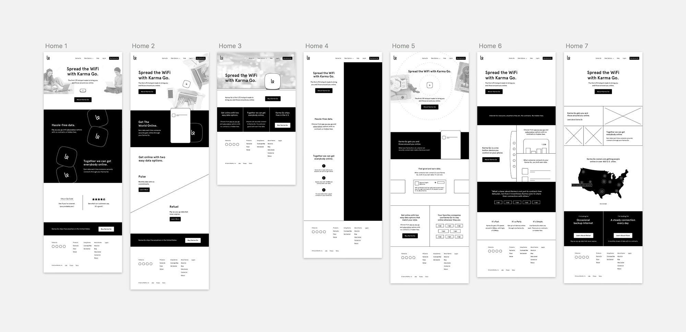

</ArticleMedia>

After deciding on a direction, we spent time shooting photos and creating new Karma Go renders for our launch a week later.

<ArticleMedia hasShadow caption="Karma's new homepage">

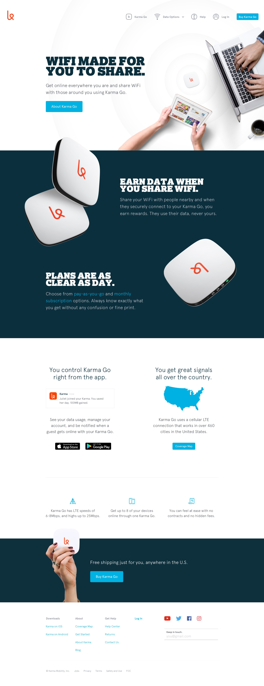

</ArticleMedia>

### Showcasing Karma Go

Compared to other hotspots wrapped in cheap plastic and carrier logos, Karma Go looked great next to a Macbook and a cup of coffee. Our customers loved sharing photos of theirs on Twitter and Instagram, and it was frequently featured in fashion-forward buyer guides. But despite how much attention we put into Karma Go's design, we never designed a product page to showcase it in detail.

To show how Karma Go could fit into your lifestyle, I spent a few days photographing it alongside objects it might appear with – notebooks and MetroCards for people using Karma Go at work, and trail maps and passports for those on the go.

<ArticleMedia hasShadow caption="Karma Go's product page">

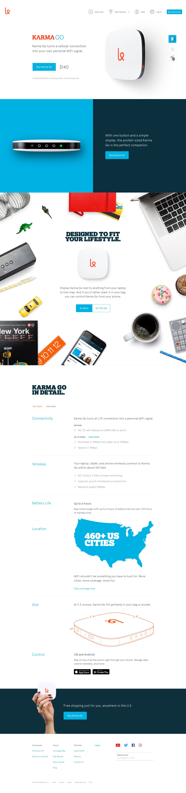

</ArticleMedia>

### Explaining our plans

Finally, we needed to update our pricing page to explain the new differences between Refuel (our pay-as-you-go option) and Pulse. Our idea was to design a page for each – giving us the opportunity to go into detail on benefits, use cases, and customer feedback specific to both plans.

<ArticleMedia hasShadow caption="Our first attempt at a set of pricing pages for Refuel and Pulse">

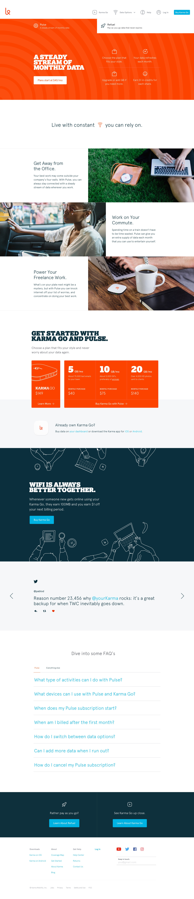

</ArticleMedia>

Splitting pricing across two pages was confusing in practice. Emotional use cases can be effective, but we relied too heavily on them at the expense of making our plans understandable. People wanted to see features laid out side-by-side – giving them the chance to make their own decision on which plan worked for them.

<ArticleMedia hasShadow caption="The second, simpler version of Karma's pricing page">

</ArticleMedia>

### Premium features

In July, we released Premium Features – an optional set of add-ons for our customers. The set of Premium Features would expand over time, but our set of launch features was sparse. Securing Karma Go's SSID would allow for several frequently requested functions though, so we designed a page to explain what subscribing meant for how a customer could use their Karma Go.

<ArticleMedia hasShadow caption="Premium Features">

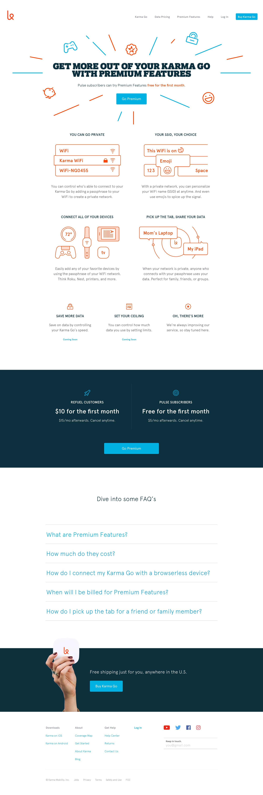

</ArticleMedia>

## Thanks

 Startups are hard. In the end, Karma's investors installed a telecom industry CEO and transformed the company into everything we were working against. Karma Go was replaced with cheap hardware powered by off-the-shelf software. But like my work at <Link to="/etsy">Etsy</Link> and <Link to="/cover">Cover</Link>, I'm happy to say we created something for the right reasons – working towards a future of affordable and accessible Internet for everyone.

 Special thanks to those I worked most closely with – [Alan Dickinson](https://twitter.com/alandickinson), [Andrew Sowers](https://twitter.com/AndrewSowers), [Ankur Vashi](https://twitter.com/ankur_vashi), [Dave Ford](https://twitter.com/daveofthefuture), [Diederick Lawson](https://twitter.com/dkln), [Jessie Goldberg](https://twitter.com/JessieGoldberg), [Paul Bakker](https://twitter.com/JessieGoldberg), [Peter Sunna](https://twitter.com/petersunna), [Sheridan Kates](https://twitter.com/sheridanvk), Sjoerd Smit, [Stefan Borsje](https://twitter.com/sborsje), and [Stevan van Wel](https://twitter.com/stevenvanwel). 
